# Pilot Study: Measuring LLM Code Generation Consistency for Platform Integration

**Team:** EngramForge Engineering  
**Date:** 2026-02-09  
**Version:** 1.5  
**Repository:** [llm-codebench](https://github.com/engramforge/llm-codebench)  
**Code & Data:** [engramforge/research/llm-codegen-benchmark](https://github.com/engramforge/research/tree/main/llm-codegen-benchmark)  
**Guidelines:** [RESEARCH_GUIDELINES.md](RESEARCH_GUIDELINES.md)

> **Context:** This document describes a pilot study we conducted as part of our platform engineering process. We needed to select and integrate LLM providers into a code generation subsystem and wanted to make that decision based on empirical data rather than vendor claims or anecdotal experience. The methodology here is straightforward—multi-run testing with statistical analysis—but it materially changed the decisions we made.

---

## Table of Contents

- [1. Executive Summary](#1-executive-summary)
  - [Key Findings](#key-findings)
  - [Model Rankings (Entropy-Controlled)](#model-rankings-entropy-controlled)
- [2. Introduction](#2-introduction)
  - [Background](#background)
  - [Questions We Needed to Answer](#questions-we-needed-to-answer)
  - [Evaluation Dimensions](#evaluation-dimensions)
- [3. Methodology](#3-methodology)
  - [3.1 Task Design](#31-task-design)
  - [3.2 Baseline Codebases](#32-baseline-codebases)
  - [3.3 Quality Gates](#33-quality-gates)
  - [3.4 Prompt Construction](#34-prompt-construction)
  - [3.5 API Configuration](#35-api-configuration)
  - [3.6 Entropy Control](#36-entropy-control)
  - [3.7 Meta-Prompting (Exploratory)](#37-meta-prompting-exploratory)
- [4. Results](#4-results)
  - [4.1 Entropy-Controlled Results (165 Runs, 11 Models)](#41-entropy-controlled-results-165-runs-11-models)
  - [4.2 Cost Comparison](#42-cost-comparison)
  - [4.3 Meta-Prompting Preference Profiles](#43-meta-prompting-preference-profiles)
  - [4.4 Adaptive Prompting A/B Results](#44-adaptive-prompting-ab-results)
- [5. Analysis](#5-analysis)
  - [5.1 Observing Survivorship Bias in Our Own Process](#51-observing-survivorship-bias-in-our-own-process)
  - [5.2 Framework-Dependent Variance](#52-framework-dependent-variance)
  - [5.3 The Cost–Quality Frontier](#53-the-costquality-frontier)
  - [5.4 Meta-Prompting Analysis](#54-meta-prompting-analysis)
  - [5.5 Statistical Hypothesis Tests](#55-statistical-hypothesis-tests)
  - [5.6 Code Quality Meta-Analysis](#56-code-quality-meta-analysis)
- [6. Prompt Templates](#6-prompt-templates)
  - [6.1 Brownfield Task Prompt (Python/FastAPI)](#61-brownfield-task-prompt-pythonfastapi)
  - [6.2 Meta-Prompt Template (Model Preference Discovery)](#62-meta-prompt-template-model-preference-discovery)
  - [6.3 Model-Specific Prompt Adaptations](#63-model-specific-prompt-adaptations)
  - [6.4 Task Definition Schema](#64-task-definition-schema)
- [7. Implementation Guide](#7-implementation-guide)
  - [7.1 Supporting Data & Scripts](#71-supporting-data--scripts)
  - [7.2 Prerequisites](#72-prerequisites)
  - [7.3 Running a Single Benchmark](#73-running-a-single-benchmark)
  - [7.4 Running the Full Benchmark Suite](#74-running-the-full-benchmark-suite)
  - [7.5 Analyzing Results](#75-analyzing-results)
  - [7.6 Discovering Model Preferences](#76-discovering-model-preferences)
  - [7.7 Adding a New Task](#77-adding-a-new-task)
  - [7.8 Adding a New Model](#78-adding-a-new-model)
- [8. Limitations & Future Work](#8-limitations--future-work)
  - [8.1 Current Limitations](#81-current-limitations)
  - [8.2 Planned Next Steps](#82-planned-next-steps)
- [9. Conclusions](#9-conclusions)
  - [What We Learned](#what-we-learned)
  - [Decisions This Informed](#decisions-this-informed)
  - [Advice for Others Building Similar Systems](#advice-for-others-building-similar-systems)
- [10. Appendices](#10-appendices)
  - [Appendix A: Complete FastAPI Prompt](#appendix-a-complete-fastapi-prompt)
  - [Appendix B: Scoring Weights](#appendix-b-scoring-weights)
  - [Appendix C: GPT-4o-mini FastAPI Failure Analysis](#appendix-c-gpt-4o-mini-fastapi-failure-analysis)
  - [Appendix D: GPT-5.2 FastAPI Failure Analysis](#appendix-d-gpt-52-fastapi-failure-analysis)
  - [Appendix E: Tool Versions](#appendix-e-tool-versions)
  - [Appendix F: Repository Structure](#appendix-f-repository-structure)
  - [Appendix G: Code Quality Meta-Analysis](#appendix-g-code-quality-meta-analysis)
    - [G.7 LLM-Judged Quality Scoring](#g7-llm-judged-quality-scoring)

---

## 1. Executive Summary

As part of building a platform that integrates LLM-generated code into existing applications, we needed answers to practical questions: which models produce code that actually compiles, passes tests, and meets lint standards? How consistent are they? Can we trust a single test run?

To find out, we benchmarked 11 LLMs — spanning four providers (Anthropic, Google, OpenAI) and two self-hosted models via Ollama Cloud (DeepSeek, Qwen) — against a standardized brownfield task across three enterprise frameworks (Python/FastAPI, C#/ASP.NET Core 9, Java/Spring Boot 3). Each model was asked to add an Orders endpoint to an existing codebase, and the generated code was evaluated against five automated quality gates: diff extraction, diff application, test execution, type checking, and linting.

### Key Findings

**1. Multi-run testing is essential.** Single-run benchmarks produced misleading results. When we ran GPT-4o-mini on FastAPI five times under entropy control, it never passed all five gates—scoring 0.80 ± 1.10 despite earlier cherry-picked runs suggesting 100% reliability. Adopting multi-run testing with variance reporting changed our model rankings significantly.

**2. Variance differs dramatically by model.** Claude Sonnet 4.5 averaged 4.93 gates with σ=0.26, while GPT-5.2 on FastAPI scored 3.00 ± 2.74 gates—meaning individual results are nearly unpredictable. Statistical testing (Kruskal-Wallis H=56.65, p<0.001) confirms models produce significantly different quality distributions.

**3. Framework choice does not significantly affect quality.** A Friedman test across all 11 models with full 3-task coverage found no significant framework effect (χ²=5.35, p=0.069). However, Python/FastAPI consistently exposes the most variance, likely due to type annotation and dependency injection requirements, while Spring Boot and ASP.NET Core remain more stable.

**4. Cost and quality don't always correlate.** Gemini 3 Flash Preview ($0.005/run) scored 4.93/5 gates, outperforming Claude Opus 4.6 ($0.290/run, 58× more expensive) at 4.53/5. The Pareto frontier includes Gemini 3 Flash (best value), Gemini 3 Pro Preview (perfect quality at $0.022/run), and Claude Sonnet 4.5 (tied highest quality at $0.043/run).

**5. Meta-prompting shows a model-dependent positive trend but is not universally effective.** We profiled all 11 models for prompt format preferences and ran A/B tests with n=5 per condition on FastAPI (the highest-variance task). Mean gate pass rate improved from 4.16/5 (baseline) to 4.42/5 (adapted), a +6.1% increase. Six of 11 models improved, 4 degraded, and 1 was unchanged. Three models showed individually significant effects (Mann-Whitney U, p<0.05): GPT-4o-mini improved dramatically (+3.0 gates, all 5 adapted runs passing), Claude Opus 4.6 improved (+1.2 gates), and GPT-5.2 degraded (−1.4 gates). The overall sign test across models was not significant (p=0.754), indicating the intervention helps some models but hurts others. See §4.4 and §5.4 for the full analysis.

**6. No sharp tier boundaries exist between models.** Mann-Whitney U tests between all adjacent-ranked models found no statistically significant differences at α=0.05. Quality degrades gradually across the 11-model ranking.

**7. Functional correctness and code quality are different axes.** LLM-judged evaluation across all 165 runs reveals the correctness leaderboard and quality leaderboard diverge substantially. Claude Sonnet 4.5 leads on gate pass rate (4.93/5) but ranks 9th of 11 on qualitative code quality (4.00/5). GPT-4o leads quality (4.28/5). Clean code scores are universally high (μ=4.38), but design pattern appropriateness ranges from 63% to 88%, with open-weight models trailing proprietary ones on this dimension specifically. The quality range across all models is compressed to just 0.34 points — all models write *structurally sound* code; the differentiator is whether it *works*.

### Model Rankings (Entropy-Controlled, n=5 per cell, temperature=0.2)

| Rank | Model | Mean Gates (All Tasks) | σ | Cost/Run | Recommendation |
|------|-------|----------------------|---|----------|----------------|
| 1 | Gemini 3 Pro Preview | 5.00 | 0.00 | $0.022 | Only model with perfect 15/15 runs |
| 2 | Claude Sonnet 4.5 | 4.93 | 0.26 | $0.043 | Near-perfect, highest quality prose |
| 3 | Gemini 3 Flash Preview | 4.93 | 0.26 | $0.005 | Best value for near-perfect results |
| 4 | GPT-4o | 4.93 | 0.26 | $0.015 | Good value, variable on ASP.NET |
| 5 | Claude Opus 4.6 | 4.53 | 0.83 | $0.290 | 58× Gemini Flash cost, worse quality |
| 6 | Gemini 2.5 Pro | 4.33 | 0.98 | $0.018 | Mid-tier, unreliable types/tests |
| 7 | Qwen3-Coder-Next | 4.07 | 0.96 | †sub | Open-weight via Ollama Cloud |
| 8 | GPT-5.2 | 4.00 | 1.69 | $0.026 | Bimodal on FastAPI (5/5 or 0/5) |
| 9 | DeepSeek V3.2 | 3.87 | 1.64 | †sub | Open-weight via Ollama Cloud |
| 10 | GPT-4o-mini | 3.60 | 2.13 | $0.001 | Cheapest but unreliable on Python |
| 11 | Gemini 2.5 Flash | 3.33 | 0.62 | $0.007 | Never achieves 5/5 (0% perfect rate) |

*†sub = Ollama Cloud subscription pricing. 5 additional smoke-test-only models (Claude Sonnet 4, Claude Opus 4.5, Claude Haiku 4.5, Qwen2.5-Coder:7b/14b) were excluded for lacking full 3-task grid coverage.*

---

## 2. Introduction

### Background

Our platform includes a subsystem that uses LLMs to generate code modifications for existing applications. During initial development, we were making model selection and prompt design decisions based on ad hoc testing—running a model, checking whether the output looked right, and moving on. This worked for prototyping, but as we moved toward production, we needed a more rigorous approach.

The specific concern was straightforward: LLMs are non-deterministic. Even at low temperature settings, the same prompt can produce different outputs on different runs. A model that generates correct code once might generate broken code the next time. We needed to understand the extent of this variance and account for it in our architecture.

Additionally, our platform targets multiple enterprise frameworks. We couldn't assume that a model performing well on Python tasks would perform equally well on C# or Java tasks. We needed cross-framework data.

### Questions We Needed to Answer

This pilot study was designed to inform specific engineering decisions:

- **Q1:** Which LLMs produce code that reliably passes our automated quality gates across Python, C#, and Java?
- **Q2:** How much run-to-run variance should we expect, and how does it differ by model and framework?
- **Q3:** Does the way we structure prompts affect output quality, and can models themselves provide useful guidance on prompt format?
- **Q4:** What automated quality gates give us a practical, CI-compatible measure of generated code quality?

### Evaluation Dimensions

For our platform's quality scoring subsystem, we assess generated code across eight weighted attributes. These weights reflect the priorities of enterprise API development:

| Attribute | Weight | What It Measures |
|-----------|--------|------------------|
| Security | 25% | Input validation, auth handling, injection prevention |
| Stability | 20% | Test pass rate, error handling, edge cases |
| Efficiency | 15% | Algorithmic choices, unnecessary allocations |
| Parallelism | 10% | Async patterns, thread safety |
| Complexity | 10% | Cyclomatic complexity, maintainability |
| Integration | 10% | Diff quality, minimal changes, clean application |
| Statefulness | 5% | Proper state management, idempotency |
| Entropy | 5% | Consistency across repeated runs |

These weights were calibrated for enterprise API development where security and stability are prioritized.

---

## 3. Methodology

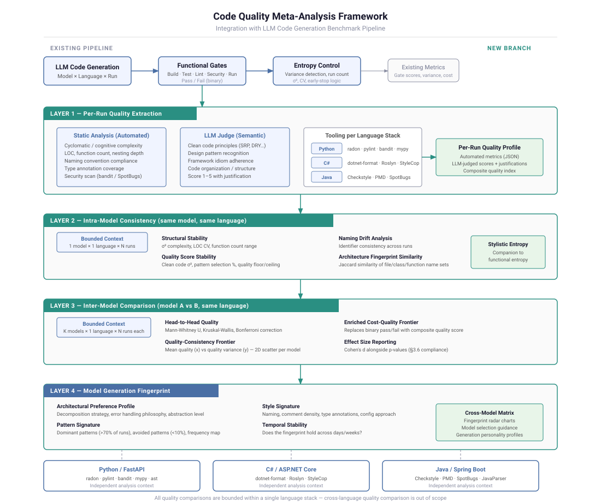
*Figure 1: Full benchmark pipeline. Task definitions, baseline code, prompt templates, and model configuration feed into prompt assembly. The assembled prompt is sent to an LLM API, and the output passes through five sequential quality gates (diff extraction → diff application → tests → type-checking → linting). An entropy control loop re-runs cells when variance is high. Per-run metrics are aggregated into intra-model consistency analysis, inter-model comparison, and model generation fingerprints.*

### 3.1 Task Design

We designed a single brownfield task—adding an Orders endpoint—implemented identically across three frameworks. This controls for task complexity while measuring framework-specific code generation quality.

**Task specification (YAML):**

```yaml
id: fastapi-001
stack: fastapi
type: brownfield_patch
description: "Add /api/v1/orders endpoint with Pydantic validation and auth dependency"

requirements:
  - "Create OrderItem model with product_id (str), quantity (int > 0), unit_price (float > 0)"
  - "Create OrderCreate model with items (list of OrderItem, non-empty) and notes (optional str)"
  - "Create OrderResponse model with id, items, total_amount, created_at, status"
  - "Add POST /api/v1/orders endpoint that requires authentication"
  - "Calculate total_amount as sum of (quantity * unit_price) for all items"
  - "Return 201 on success with created order"
  - "Return 401 if not authenticated"
  - "Return 422 if validation fails"
  - "Add tests for: valid order, empty items, negative quantity, unauthenticated"

constraints:
  output_format: unified_diff
  max_new_deps: 0
  must_update_tests: true
```

Equivalent task definitions exist for ASP.NET Core 9 (`aspnetcore-001`) and Spring Boot 3 (`springboot-001`), adapted to each framework's idioms (e.g., `[MinLength(1)]` attributes for C#, `@Valid` annotations for Java).

### 3.2 Baseline Codebases

Each framework has a pre-built baseline application with:

- A working Users CRUD endpoint
- Authentication/authorization setup
- Test fixtures and configuration
- Build/lint/type-check tooling pre-configured

The model receives the existing source files as context and must add new functionality without breaking existing code.

**Python/FastAPI baseline structure:**
```
app/
├── main.py              # FastAPI app with users router
├── dependencies/
│   └── auth.py          # get_current_user dependency
├── models/
│   └── user.py          # Existing User models
└── routers/
    └── users.py         # Existing /api/v1/users endpoint
tests/
├── conftest.py          # TestClient and auth fixtures
└── test_users.py        # Existing user tests
```

### 3.3 Quality Gates

Generated code passes through five automated gates:

| Gate | Tool | Pass Criteria |
|------|------|---------------|
| **Diff Extraction** | Custom parser | Code blocks found and parseable |
| **Diff Application** | git apply / file writer | Changes apply cleanly to baseline |
| **Tests** | pytest / xUnit / Maven | All tests pass (existing + new) |
| **Type Check** | mypy / Roslyn / javac | Zero type errors |
| **Lint** | ruff / Roslyn analyzers / Checkstyle | Zero lint violations |

A run scores 0–5 based on how many gates pass. All five must pass for a "clean" result.

### 3.4 Prompt Construction

Prompts are constructed in layers:

1. **Role and task description** — Framework-specific instruction text
2. **Requirements** — Numbered list from the task YAML
3. **Pattern examples** — Idiomatic code snippets for the target framework
4. **Output format specification** — How to structure the response
5. **Baseline file contents** — Existing source code injected from the suite directory
6. **Model-specific guidance** — Additional hints for known model weaknesses (e.g., GPT models receive extra Pydantic validation guidance)

```python
def load_prompt(task_id, model, suite_dir):
    """Load the benchmark prompt with model-specific customization."""
    
    # 1. Select framework-specific prompt template
    if task_id.startswith("aspnetcore"):
        prompt_file = PILOT_DIR / "prompt_aspnetcore.txt"
    elif task_id.startswith("springboot"):
        prompt_file = PILOT_DIR / "prompt_springboot.txt"
    else:
        prompt_file = PILOT_DIR / "prompt.txt"
    
    base_prompt = prompt_file.read_text()
    
    # 2. Inject existing baseline files as context
    baseline_context = load_baseline_files(task_id, suite_dir)
    base_prompt += baseline_context
    
    # 3. Add model-specific guidance if needed
    if task_id.startswith("fastapi") and determine_backend(model) == "openai":
        base_prompt += GPT_FASTAPI_GUIDANCE
    
    return base_prompt
```

### 3.5 API Configuration

| Parameter | OpenAI Models | Anthropic Models | Ollama |
|-----------|---------------|------------------|--------|
| Temperature | 0.2 | 0.2 | Default |
| Max tokens | 8,192 | 8,192 | Unlimited |
| System prompt | None (user message only) | None (user message only) | N/A |

Temperature is controlled uniformly at 0.2 across all commercial API providers. Early runs used Anthropic's server default; we re-ran all Anthropic cells at temperature 0.2 after identifying this as a confound (see Section 5).

### 3.6 Entropy Control

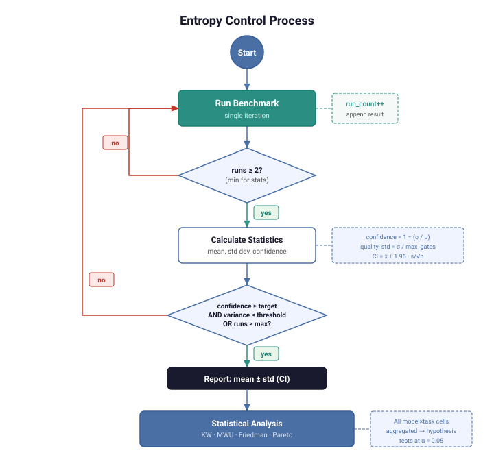
*Figure 2: Entropy control decision loop. Each benchmark iteration appends a result. After a minimum of two runs, the system calculates variance and confidence. If thresholds are not met and the run cap has not been reached, the system triggers another iteration. The loop terminates when confidence is sufficient or the maximum run count is reached.*

After observing significant run-to-run variance in initial testing, we implemented an automatic entropy control system. The `EntropyController` class manages re-run decisions:

```python
class EntropyController:
    def __init__(
        self,
        min_confidence: float = 0.90,   # Minimum required confidence level
        max_runs: int = 5,              # Maximum runs allowed
        quality_variance_threshold: float = 0.15,  # Max acceptable std dev
    ):
        ...
    
    def should_continue(self, results: List[Dict]) -> bool:
        """Determine if more runs are needed."""
        if len(results) < 2:
            return True  # Need at least 2 runs to measure variance
        
        if len(results) >= self.max_runs:
            return False  # Hit cost ceiling
        
        stats = self.get_statistics(results)
        
        if stats['quality_std'] > self.quality_variance_threshold:
            return True  # Variance too high
        
        if stats['confidence'] < self.min_confidence:
            return True  # Not confident enough
        
        return False  # Sufficient data collected
```

**How it works:**

1. Run the benchmark once
2. Run again (minimum 2 runs to measure variance)
3. Calculate standard deviation and confidence
4. If variance exceeds threshold or confidence is below minimum, run again
5. Stop at max runs or when variance stabilizes
6. Report mean ± std with confidence interval

**Confidence** is calculated as the inverse of the coefficient of variation: $\text{confidence} = \max(0, 1 - \frac{\sigma}{\mu})$, where $\sigma$ is the standard deviation and $\mu$ is the mean gate score.

**95% confidence interval** uses the normal approximation: $\bar{x} \pm 1.96 \cdot \frac{s}{\sqrt{n}}$.

### 3.7 Meta-Prompting (Exploratory)

As an exploratory side investigation, we tested a simple idea: ask models what prompt format they prefer, then adapt our prompts accordingly. This is a well-established concept in the prompt engineering space; we wanted to see if it had practical value for our specific use case. A meta-prompt asks each model seven questions about output format, instruction style, context presentation, diff format, special syntax, quality optimization, and framework-specific preferences.

```
Please analyze how you work best and provide guidance on the following aspects:

## 1. Output Format
What format do you prefer for delivering code changes?
- XML tags (e.g., <code>, <file>, <thinking>)
- Markdown code blocks with file paths
- Unified diff format
- Other format you prefer

## 2. Instruction Style
What instruction style helps you generate the highest quality code?
- Detailed step-by-step instructions
- High-level goals with freedom to implement
- Constraint-based (must/must not requirements)
...
```

Responses are stored as preference profiles and optionally applied to subsequent benchmark prompts via the `--use-model-preferences` flag. Adaptations include wrapping prompts in XML structural tags (for Claude models), adding numbered step instructions (for GPT models), and other format adjustments.

---

## 4. Results

### 4.1 Entropy-Controlled Results (165 Runs, 11 Models)

All results below use multi-run testing with uniform temperature (0.2) across all providers. The full grid comprises 11 models × 3 tasks = 33 cells, each with exactly n=5 (165 total runs). Smoke-test-era runs (pre-Feb 7) were isolated to `pilot/results/_smoke_tests/`, and excess entropy-era runs beyond n=5 per cell were moved to `pilot/results/_excess_entropy/` to ensure parity. Five additional smoke-test-only models (Claude Sonnet 4, Claude Opus 4.5, Claude Haiku 4.5, Qwen2.5-Coder:7b, Qwen2.5-Coder:14b) were excluded for lacking full 3-task coverage.

#### Summary Table

| Model | Task | n | Gates Passed | 95% CI | Perfect Rate | Cost/Run |
|-------|------|---|--------------|--------|--------------|----------|
| Gemini 3 Pro Preview | fastapi-001 | 5 | 5.00 ± 0.00 | [5.00, 5.00] | 100% | $0.016 |
| Gemini 3 Pro Preview | aspnetcore-001 | 5 | 5.00 ± 0.00 | [5.00, 5.00] | 100% | $0.023 |
| Gemini 3 Pro Preview | springboot-001 | 5 | 5.00 ± 0.00 | [5.00, 5.00] | 100% | $0.026 |
| Claude Sonnet 4.5 | fastapi-001 | 5 | 4.80 ± 0.45 | [4.24, 5.00] | 80% | $0.025 |
| Claude Sonnet 4.5 | aspnetcore-001 | 5 | 5.00 ± 0.00 | [5.00, 5.00] | 100% | $0.059 |
| Claude Sonnet 4.5 | springboot-001 | 5 | 5.00 ± 0.00 | [5.00, 5.00] | 100% | $0.044 |
| Gemini 3 Flash Preview | fastapi-001 | 5 | 4.80 ± 0.45 | [4.24, 5.00] | 80% | $0.003 |
| Gemini 3 Flash Preview | aspnetcore-001 | 5 | 5.00 ± 0.00 | [5.00, 5.00] | 100% | $0.006 |
| Gemini 3 Flash Preview | springboot-001 | 5 | 5.00 ± 0.00 | [5.00, 5.00] | 100% | $0.006 |
| GPT-4o | fastapi-001 | 5 | 5.00 ± 0.00 | [5.00, 5.00] | 100% | $0.012 |
| GPT-4o | aspnetcore-001 | 5 | 4.80 ± 0.45 | [4.24, 5.00] | 80% | $0.017 |
| GPT-4o | springboot-001 | 5 | 5.00 ± 0.00 | [5.00, 5.00] | 100% | $0.018 |
| Claude Opus 4.6 | fastapi-001 | 5 | 3.60 ± 0.89 | [2.49, 4.71] | 20% | $0.177 |
| Claude Opus 4.6 | aspnetcore-001 | 5 | 5.00 ± 0.00 | [5.00, 5.00] | 100% | $0.376 |
| Claude Opus 4.6 | springboot-001 | 5 | 5.00 ± 0.00 | [5.00, 5.00] | 100% | $0.315 |
| Gemini 2.5 Pro | fastapi-001 | 5 | 4.00 ± 1.41 | [2.24, 5.00] | 60% | $0.013 |
| Gemini 2.5 Pro | aspnetcore-001 | 5 | 4.80 ± 0.45 | [4.24, 5.00] | 80% | $0.016 |
| Gemini 2.5 Pro | springboot-001 | 5 | 4.20 ± 0.84 | [3.16, 5.00] | 40% | $0.025 |
| Qwen3-Coder-Next | fastapi-001 | 5 | 4.20 ± 1.10 | [2.84, 5.00] | 60% | †sub |
| Qwen3-Coder-Next | aspnetcore-001 | 5 | 4.60 ± 0.55 | [3.92, 5.00] | 60% | †sub |
| Qwen3-Coder-Next | springboot-001 | 5 | 3.40 ± 0.89 | [2.29, 4.51] | 20% | †sub |
| GPT-5.2 | fastapi-001 | 5 | 3.00 ± 2.74 | [0.00, 5.00] | 60% | $0.015 |
| GPT-5.2 | aspnetcore-001 | 5 | 4.00 ± 0.00 | [4.00, 4.00] | 0% | $0.030 |
| GPT-5.2 | springboot-001 | 5 | 5.00 ± 0.00 | [5.00, 5.00] | 100% | $0.031 |
| DeepSeek V3.2 | fastapi-001 | 5 | 4.40 ± 0.55 | [3.72, 5.00] | 40% | †sub |
| DeepSeek V3.2 | aspnetcore-001 | 5 | 3.00 ± 2.74 | [0.00, 5.00] | 60% | †sub |
| DeepSeek V3.2 | springboot-001 | 5 | 4.20 ± 0.45 | [3.64, 4.76] | 20% | †sub |
| GPT-4o-mini | fastapi-001 | 5 | 0.80 ± 1.10 | [0.00, 2.16] | 0% | $0.001 |
| GPT-4o-mini | aspnetcore-001 | 5 | 5.00 ± 0.00 | [5.00, 5.00] | 100% | $0.001 |
| GPT-4o-mini | springboot-001 | 5 | 5.00 ± 0.00 | [5.00, 5.00] | 100% | $0.001 |
| Gemini 2.5 Flash | fastapi-001 | 5 | 2.80 ± 0.45 | [2.24, 3.36] | 0% | $0.005 |
| Gemini 2.5 Flash | aspnetcore-001 | 5 | 3.60 ± 0.55 | [2.92, 4.28] | 0% | $0.007 |
| Gemini 2.5 Flash | springboot-001 | 5 | 3.60 ± 0.55 | [2.92, 4.28] | 0% | $0.008 |

*†sub = Ollama Cloud subscription pricing (not per-token).*

#### Per-Gate Pass Rates (All Tasks Combined)

| Model | n | Diff Extract | Diff Apply | Tests | Types | Lint |
|-------|---|-------------|------------|-------|-------|------|
| Gemini 3 Pro Preview | 15 | 100% | 100% | 100% | 100% | 100% |
| Claude Sonnet 4.5 | 15 | 100% | 100% | 93% | 100% | 100% |
| Gemini 3 Flash Preview | 15 | 100% | 100% | 93% | 100% | 100% |
| GPT-4o | 15 | 100% | 100% | 100% | 93% | 100% |
| Claude Opus 4.6 | 15 | 100% | 100% | 80% | 100% | 73% |
| Gemini 2.5 Pro | 15 | 100% | 100% | 67% | 73% | 93% |
| Qwen3-Coder-Next | 15 | 100% | 100% | 60% | 47% | 100% |
| GPT-5.2 | 15 | 87% | 87% | 53% | 87% | 87% |
| DeepSeek V3.2 | 15 | 87% | 87% | 40% | 87% | 87% |
| GPT-4o-mini | 15 | 80% | 80% | 67% | 67% | 67% |
| Gemini 2.5 Flash | 15 | 100% | 100% | 7% | 60% | 67% |

The heatmap below visualizes these pass rates across all 11 models and 5 gates. The color gradient makes failure concentration immediately visible: diff extraction and application are near-universal (green), while tests, types, and lint expose the true separation between models. Gemini 3 Pro Preview is the only model achieving solid green across all five columns.

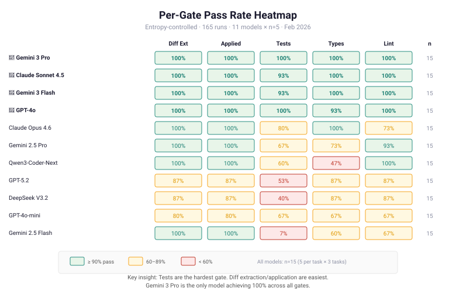

*Figure 3: Per-gate pass rates across 11 models (n=15 each, 3 tasks × 5 runs). Models ranked by aggregate gate score. Green = 100%, yellow = 60–99%, red = <60%. Diff extraction/application are near-universal; tests, types, and lint are the differentiating gates.*

#### Individual Run Scores (GPT-4o-mini on FastAPI)

Run-by-run detail for the highest-variance model/task combination:

```
Run 1:  0/5 gates  [✗ extract, ✗ apply, ✗ tests, ✗ types, ✗ lint]
Run 2:  2/5 gates  [✓ extract, ✓ apply, ✗ tests, ✗ types, ✗ lint]
Run 3:  2/5 gates  [✓ extract, ✓ apply, ✗ tests, ✗ types, ✗ lint]
Run 4:  0/5 gates  [✗ extract, ✗ apply, ✗ tests, ✗ types, ✗ lint]
Run 5:  0/5 gates  [✗ extract, ✗ apply, ✗ tests, ✗ types, ✗ lint]

Mean: 0.80 ± 1.10 / 5 gates
95% CI: [0.00, 2.16]
```

Common failure mode: `NameError: name 'User' is not defined` — the model generates a dependency on the `User` type in the orders router but omits the import.

### 4.2 Cost Comparison

| Model | FastAPI Cost | ASP.NET Cost | Spring Boot Cost | Avg/Run |
|-------|-------------|-------------|-----------------|---------|
| GPT-4o-mini | $0.001 | $0.001 | $0.001 | **$0.001** |
| Gemini 3 Flash Preview | $0.003 | $0.006 | $0.006 | $0.005 |
| Gemini 2.5 Flash | $0.004 | $0.008 | $0.008 | $0.007 |
| GPT-4o | $0.012 | $0.017 | $0.018 | $0.015 |
| Gemini 2.5 Pro | $0.010 | $0.022 | $0.022 | $0.018 |
| Gemini 3 Pro Preview | $0.014 | $0.024 | $0.025 | $0.021 |
| GPT-5.2 | $0.015 | $0.030 | $0.031 | $0.026 |
| Claude Sonnet 4.5 | $0.025 | $0.059 | $0.044 | $0.043 |
| Claude Opus 4.6 | $0.177 | $0.376 | $0.315 | **$0.290** |
| Qwen3-Coder-Next | †sub | †sub | †sub | †sub |
| DeepSeek V3.2 | †sub | †sub | †sub | †sub |

Claude Opus 4.6 costs 290× more than GPT-4o-mini and 58× more than Gemini 3 Flash — with worse quality than both Gemini 3 models.

*†sub = Ollama Cloud subscription pricing ($20/mo Pro, $100/mo Max). Not free for API access; free only when run locally.*

### 4.3 Meta-Prompting Preference Profiles

We profiled all 11 models using the meta-prompt described in §3.7. Each model was asked seven questions about output format, instruction style, context presentation, diff format, special syntax, quality optimization, and framework-specific preferences. The profiling cost was minimal ($0.001–$0.17 per model, ~$0.60 total).

**Key preference clusters:**

Models self-organized into recognizable preference families:

| Preference Dimension | Claude Models | GPT Models | Gemini Models | Open-Weight Models |
|---------------------|---------------|------------|---------------|-------------------|
| Output structure | XML tags | Markdown headings | Markdown headings | Markdown headings |
| Instruction style | Detailed steps + thinking | Detailed numbered steps | Detailed steps | Detailed steps |
| Diff format | Unified diff | Unified diff | Unified diff | Unified diff |
| File presentation | Markdown blocks | Markdown blocks | Markdown blocks | Markdown blocks |
| Special syntax | XML structural tags | Step numbering | None significant | None significant |

**Notable individual preferences:**

- **Claude models** (Opus 4.6, Sonnet 4.5): Strong preference for XML structural tags (`<analysis>`, `<thinking>`, `<file>`), explicit thinking sections before code
- **GPT-4o-mini**: Requested mixed granularity (high-level goals + detailed steps), flat markdown
- **GPT-5.2**: Preferred high-level goals with explicit constraints, minimal scaffolding
- **Gemini models**: Varied — Gemini 2.5 Flash preferred minimal structure, while Gemini 3 Pro preferred detailed step-by-step
- **DeepSeek V3.2, Qwen3-Coder-Next**: Requested XML structure (similar to Claude), detailed steps

The full profiles are stored in `pilot/model_preferences/` as structured markdown documents. Each profile was generated in a single API call at the model's default temperature.

### 4.4 Adaptive Prompting A/B Results

We ran a controlled A/B test across all 11 models on the FastAPI task (the highest-variance task in our benchmark). Each model was tested under two conditions: **baseline** (standard prompt, no adaptation) and **adapted** (prompt modified according to the model's self-reported preferences from §4.3). Each condition was run n=5 times at temperature=0.2.

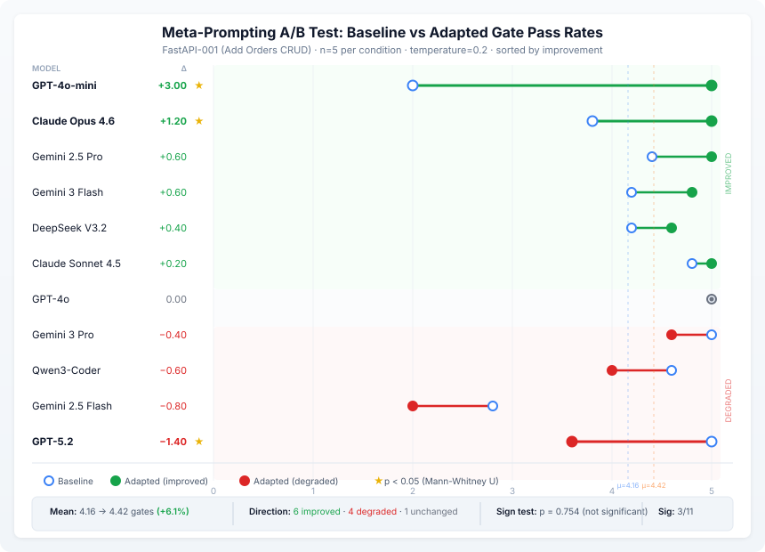

*Figure: Dumbbell chart showing baseline (○) vs adapted (●) mean gate pass rates for each model, sorted by improvement. Green lines indicate improvement, red indicates degradation. ★ marks statistically significant differences (Mann-Whitney U, p<0.05). Dashed vertical lines show the overall baseline mean (μ=4.16, blue) and adapted mean (μ=4.42, orange).*

#### Per-Model Results

| Model | Baseline (mean gates) | Adapted (mean gates) | Δ | Direction | MWU p-value |
|-------|----------------------|---------------------|---|-----------|-----------|
| Claude Opus 4.6 | 3.80 | **5.00** | +1.20 | ▲ Better | **0.009** |
| Claude Sonnet 4.5 | 4.80 | 5.00 | +0.20 | ▲ Better | 0.602 |
| Gemini 2.5 Flash | 2.80 | 2.00 | −0.80 | ▼ Worse | 0.251 |
| Gemini 2.5 Pro | 4.40 | **5.00** | +0.60 | ▲ Better | 0.602 |
| Gemini 3 Flash Preview | 4.20 | 4.80 | +0.60 | ▲ Better | 0.465 |
| Gemini 3 Pro Preview | 5.00 | 4.60 | −0.40 | ▼ Worse | 0.296 |
| GPT-4o | 5.00 | 5.00 | 0.00 | = Same | 1.000 |
| GPT-4o-mini | 2.00 | **5.00** | **+3.00** | ▲ Better | **0.009** |
| GPT-5.2 | 5.00 | 3.60 | **−1.40** | ▼ Worse | **0.009** |
| DeepSeek V3.2 | 4.20 | 4.60 | +0.40 | ▲ Better | 0.602 |
| Qwen3-Coder-Next | 4.60 | 4.00 | −0.60 | ▼ Worse | 0.917 |
| **Mean** | **4.16** | **4.42** | **+0.25** | | |

**Bold** p-values are significant at α=0.05 (Mann-Whitney U, two-sided).

#### Aggregate Statistics

- **Overall**: +6.1% improvement in mean gate pass rate (4.16 → 4.42)
- **Direction**: 6 improved, 4 degraded, 1 unchanged
- **Individually significant**: 3/11 models (2 positive, 1 negative)
- **Sign test across models**: p=0.754 (not significant at α=0.05)

#### Per-Run Detail

The raw per-run gate counts reveal the variance within each condition:

| Model | Baseline runs [gates] | Adapted runs [gates] |
|-------|----------------------|---------------------|
| Claude Opus 4.6 | [4, 4, 4, 3, 4] | [5, 5, 5, 5, 5] |
| Claude Sonnet 4.5 | [5, 5, 4, 5, 5] | [5, 5, 5, 5, 5] |
| Gemini 2.5 Flash | [3, 3, 2, 3, 3] | [2, 0, 3, 2, 3] |
| Gemini 2.5 Pro | [5, 5, 5, 2, 5] | [5, 5, 5, 5, 5] |
| Gemini 3 Flash Preview | [5, 5, 3, 3, 5] | [5, 5, 5, 5, 4] |
| Gemini 3 Pro Preview | [5, 5, 5, 5, 5] | [5, 4, 5, 4, 5] |
| GPT-4o | [5, 5, 5, 5, 5] | [5, 5, 5, 5, 5] |
| GPT-4o-mini | [2, 2, 2, 2, 2] | [5, 5, 5, 5, 5] |
| GPT-5.2 | [5, 5, 5, 5, 5] | [4, 2, 4, 4, 4] |
| DeepSeek V3.2 | [5, 5, 2, 5, 4] | [5, 5, 5, 3, 5] |
| Qwen3-Coder-Next | [3, 5, 5, 5, 5] | [5, 0, 5, 5, 5] |

Total runs: 110 (11 models × 2 conditions × 5 runs). Estimated total cost: ~$12.

---

## 5. Analysis

### 5.1 Observing Survivorship Bias in Our Own Process

When we reviewed our initial benchmark data, we noticed that our reported results were significantly more optimistic than what we were seeing in day-to-day use. Investigating further, we found the cause: during development, we had naturally run models multiple times while debugging prompts and the evaluation pipeline, and we'd reported the successful runs.

**Example:** GPT-4o-mini on FastAPI had the following chronological run history during our initial development:

| Time | Gates | Notes |
|------|-------|-------|
| 09:32 | 1/5 | Failed extraction |
| 11:08 | 2/5 | Applied but tests/types/lint failed |
| 11:12 | 2/5 | Same failure pattern |
| 11:13 | 3/5 | Partial improvement |
| 11:19 | 3/5 | Same |
| 11:22 | 5/5 | First full pass → reported as result |
| 15:54 | 5/5 | Confirmed → reported in benchmark table |

**Reported:** 100% gate pass rate.  
**Actual:** 2 out of 7 runs passed (29%).

This is a well-known issue in testing non-deterministic systems—survivorship bias during iterative development. It wasn't intentional; it's just what happens when you test, fix, re-test, and report the latest result. Recognizing this in our own process is what motivated us to build the entropy control system and re-run everything systematically.

### 5.2 Framework-Dependent Variance

The most striking pattern in our data is that variance concentrates on Python/FastAPI while ASP.NET Core and Spring Boot remain more stable. The Friedman test (χ²=5.35, p=0.069) shows this trend approaches but does not reach significance across all 11 models:

| Model | FastAPI σ | ASP.NET σ | Spring Boot σ |
|-------|----------|-----------|---------------|
| Gemini 3 Pro Preview | 0.00 | 0.00 | 0.00 |
| Claude Sonnet 4.5 | 0.45 | 0.00 | 0.00 |
| Gemini 3 Flash Preview | 0.45 | 0.00 | 0.00 |
| GPT-4o | 0.00 | 0.45 | 0.00 |
| Claude Opus 4.6 | **0.89** | 0.00 | 0.00 |
| Gemini 2.5 Pro | **1.41** | 0.45 | **0.84** |
| Qwen3-Coder-Next | **1.10** | 0.55 | **0.89** |
| GPT-5.2 | **2.74** | 0.00 | 0.00 |
| DeepSeek V3.2 | 0.55 | **2.74** | 0.45 |
| GPT-4o-mini | **1.10** | 0.00 | 0.00 |
| Gemini 2.5 Flash | 0.45 | 0.55 | 0.55 |

Notable patterns:

- **FastAPI remains the hardest task** for 7 of 11 models (highest σ)
- **DeepSeek V3.2 is an outlier**: its worst variance is on ASP.NET (σ=2.74), not Python
- **Gemini 3 Pro Preview** achieves zero variance across all three frameworks — the only model with σ=0.00 everywhere
- **GPT-4o** has near-zero variance (only one ASP.NET miss), a significant improvement from the stale mixed-era data
- **Gemini 2.5 Flash** shows consistent mediocrity (σ≈0.5 everywhere, but never achieves 5/5)

Possible explanations for Python's difficulty:

1. **Python's type system is optional.** Unlike C# and Java, Python doesn't enforce types at compile time. Models must choose to add type annotations, and the quality of those annotations varies between runs.
2. **FastAPI dependency injection requires precise imports.** The auth dependency pattern (`current_user: User = Depends(get_current_user)`) requires importing both the `User` type and the `get_current_user` function. Models sometimes omit one.
3. **Pydantic v2 syntax is newer.** Models trained on older data may mix Pydantic v1 and v2 syntax (`Field(min_items=1)` vs. `Field(min_length=1)`).

### 5.3 The Cost–Quality Frontier

Plotting cost against quality across all 11 models reveals the Pareto frontier:

| Model | Gates/5 | $/run | Cost vs Cheapest | Pareto? |
|-------|---------|-------|------------------|---------|
| Qwen3-Coder-Next | 4.07 | †sub | — | ✓ |
| DeepSeek V3.2 | 3.87 | †sub | — | ✓ |
| GPT-4o-mini | 3.60 | $0.001 | 1.0× | |
| **Gemini 3 Flash Preview** | **4.93** | **$0.005** | **5.0×** | **✓ (best value)** |
| Gemini 2.5 Flash | 3.33 | $0.007 | 7.0× | |
| GPT-4o | 4.93 | $0.015 | 15.0× | ✓ |
| Gemini 2.5 Pro | 4.33 | $0.018 | 18.0× | |
| Gemini 3 Pro Preview | 5.00 | $0.022 | 22.0× | **✓ (perfect quality)** |
| GPT-5.2 | 4.00 | $0.026 | 26.0× | |
| **Claude Sonnet 4.5** | **4.93** | **$0.043** | **43.0×** | **✓ (highest quality tie)** |
| Claude Opus 4.6 | 4.53 | $0.290 | 290× | |

Key observations:

- **Gemini 3 Flash Preview** dominates the cost–quality frontier: near-perfect quality (4.93/5) at $0.005/run
- **Gemini 3 Pro Preview** is the only model to achieve 5.00/5 (15/15 runs perfect) at $0.022/run
- **Claude Sonnet 4.5** ties for highest quality (4.93) at 8.6× the cost of Gemini Flash
- **Claude Opus 4.6** is 58× more expensive than Gemini 3 Flash with *worse* quality (4.53 vs 4.93)
- **GPT-4o** rose from #5 to tie for #2 after cleaning mixed-era data; it now matches Claude Sonnet and Gemini Flash
- **GPT-4o-mini** remains the cheapest per-token option but is unreliable on Python (0.80 ± 1.10)

The scatter plot below maps every model onto the cost–quality plane, with the Pareto frontier traced through the non-dominated points. Models above and to the left of the frontier line offer strictly better value than those below it. The dramatic cost gap between Gemini 3 Flash ($0.005) and Claude Opus 4.6 ($0.290) — a 58× multiplier for *worse* quality — is the single most actionable finding for teams choosing a model.

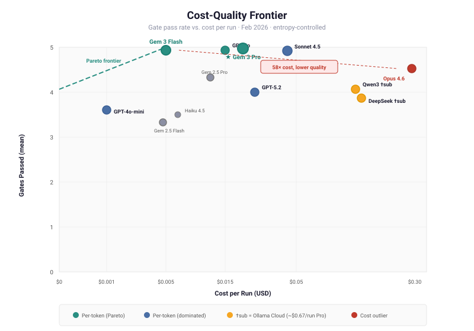

*Figure 4: Cost per run vs. mean gates passed (n=15 per model). The Pareto frontier connects Qwen3 → Gemini 3 Flash → Gemini 3 Pro. Star marker indicates the cost-efficiency sweet spot. Models below the frontier are dominated — a cheaper model achieves equal or better quality.*

### 5.4 Meta-Prompting Analysis

With the full 11-model A/B dataset (110 runs, §4.4), we can now evaluate the meta-prompting hypothesis with adequate statistical power.

#### The effect is real but model-dependent

The mean improvement of +0.25 gates (+6.1%) is positive but not statistically significant across models (sign test p=0.754). This is because the intervention *helps some models substantially while harming others*. The three individually significant effects (MWU, α=0.05) illustrate this:

| Model | Δ Gates | Cohen's d | Interpretation |
|-------|---------|-----------|----------------|
| GPT-4o-mini | **+3.00** | — | Went from 100% failure (2/5 gates) to 100% success (5/5) |
| Claude Opus 4.6 | **+1.20** | +3.79 | Eliminated remaining lint failures, achieved perfect runs |
| GPT-5.2 | **−1.40** | −2.21 | Degraded from perfect baseline to 72% gate rate |

#### Who benefits from meta-prompting?

The pattern suggests meta-prompting helps **mid-tier models with consistent failure modes** and hurts **models that are already performing well**:

- **Strong beneficiaries**: Models scoring 2.0–4.0 baseline gates (GPT-4o-mini, Claude Opus 4.6, Gemini 2.5 Pro) gained +0.6 to +3.0 gates. These models had specific, addressable weaknesses that prompt formatting could fix.
- **Already-perfect models**: GPT-4o (5.00 baseline) was unaffected — there was no room to improve. GPT-5.2 (5.00 baseline) and Gemini 3 Pro Preview (5.00 baseline) actually *degraded*, suggesting that adding structural complexity to prompts can *introduce* failures for models that already handle the task cleanly.
- **Weak models**: Gemini 2.5 Flash (2.80 baseline) got worse, not better. At this quality level, the model's limitations are fundamental, not prompt-format-dependent.

#### Ceiling and floor effects

The data reveals clear ceiling and floor effects:

- **Ceiling**: Models scoring 5.00/5 baseline cannot improve; 2 of 3 degraded with adaptation (GPT-5.2: −1.40, Gemini 3 Pro: −0.40). The adapted prompt's additional complexity appears to confuse models that already produce clean output.
- **Floor**: The weakest model (Gemini 2.5 Flash, 2.80 baseline) also degraded (−0.80). Prompt formatting cannot compensate for insufficient model capability.
- **Sweet spot**: Models in the 3.0–4.8 range saw the most benefit. Five of six models in this range improved.

#### Practical recommendations

1. **Profile is cheap, testing is required.** Profiling costs ~$0.05 per model. But whether to *use* the profile depends on the model's baseline quality — only mid-tier models reliably benefit.
2. **Don't adapt prompts for perfect-scoring models.** For GPT-4o, Gemini 3 Pro Preview, and GPT-5.2, the standard prompt already works. Adding XML tags, thinking sections, or numbered steps introduces unnecessary complexity.
3. **Do adapt for models with 60–90% gate pass rates.** Claude Opus 4.6, GPT-4o-mini, Gemini 2.5 Pro, and Gemini 3 Flash Preview all benefited from adapted prompts.
4. **The effect is task-specific.** We tested only FastAPI (the highest-variance task). The benefit may differ on ASP.NET Core and Spring Boot where baseline variance is lower.

### 5.5 Statistical Hypothesis Tests

To move beyond descriptive statistics, we applied three non-parametric tests using scipy:

#### Do models differ significantly?

**Kruskal-Wallis H-test:** H = 56.65, p < 0.001 (k = 11 groups)

→ **Yes** — models produce statistically different quality distributions. This confirms the leaderboard ordering is not an artifact of sampling.

#### Do adjacent-ranked models differ?

**Mann-Whitney U tests** between each adjacent pair in the ranking found **no significant differences** at α=0.05 for any adjacent pair. This means the ranking has no sharp tiers — quality degrades gradually from Claude Sonnet 4.5 (4.93) through Gemini 2.5 Flash (3.33). Practically, this means models within ~0.5 gates of each other are statistically interchangeable.

| Model A | vs | Model B | U | p | Sig? |
|---------|----|---------|----|----|----|
| Claude Sonnet 4.5 | vs | Gemini 3 Flash Preview | 141.0 | 0.690 | ✗ |
| Gemini 3 Flash Preview | vs | Gemini 3 Pro Preview | 154.0 | 0.621 | ✗ |
| Gemini 3 Pro Preview | vs | Claude Opus 4.6 | 163.0 | 0.110 | ✗ |
| Claude Opus 4.6 | vs | GPT-4o | 192.5 | 0.876 | ✗ |
| GPT-4o | vs | Gemini 2.5 Pro | 228.5 | 0.383 | ✗ |
| Gemini 2.5 Pro | vs | GPT-5.2 | 140.0 | 0.893 | ✗ |
| GPT-5.2 | vs | Qwen3-Coder-Next | 157.0 | 0.397 | ✗ |
| Qwen3-Coder-Next | vs | DeepSeek V3.2 | 107.0 | 0.825 | ✗ |
| DeepSeek V3.2 | vs | GPT-4o-mini | 377.5 | 0.670 | ✗ |
| GPT-4o-mini | vs | Gemini 2.5 Flash | 411.0 | 0.324 | ✗ |

#### Does framework matter?

**Friedman test:** χ² = 5.35, p = 0.069 (k = 11 models with all 3 tasks) — not significant at α=0.05

→ **No**, but the trend is suggestive (p=0.069). Framework choice does not reach statistical significance, though the pattern is consistent: Spring Boot tends to score higher and FastAPI tends to score lower across models. With more tasks or larger n, this effect might reach significance.

The diagram below summarizes all three tests and places them in the context of the full analytical pipeline:

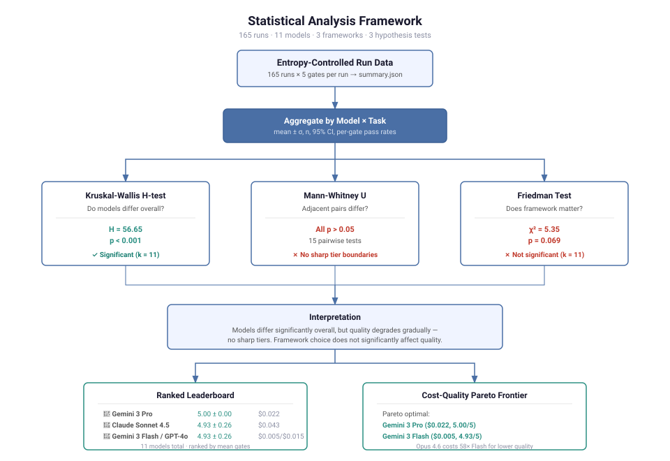

*Figure 5: Statistical hypothesis test results from 165 entropy-controlled runs. Left: Kruskal-Wallis confirms models differ significantly (H=56.65, p<0.001). Center: Mann-Whitney U tests find no significant adjacent-pair differences, indicating a smooth quality gradient. Right: Friedman test shows framework effect does not reach significance (p=0.069).*

### 5.6 Code Quality Meta-Analysis

Beyond the five quality gates (which measure whether code *works*), we ran a full code quality meta-analysis across 165 entropy-controlled runs to characterize the *qualitative character* of generated code — its structure, idiom adherence, and stylistic consistency. The structural analysis methodology and results are detailed in [Appendix G](#appendix-g-code-quality-meta-analysis); the LLM-judged quality evaluation is in [Appendix G.7](#g7-llm-judged-quality-scoring).

The core insight is that **two models can both produce passing code that is qualitatively very different.** Claude Opus 4.6 and Claude Sonnet 4.5 both score 5.0/5 gates on C# with structure Jaccard similarity of 1.0 — but Opus averages 307 LOC with 9 functions while Sonnet generates 319 LOC with 9 functions and slightly more variation (LOC CV 0.01 vs 0.001). These differences are invisible to gate-based scoring.

The analysis operates at four layers. Layer 1 has two tracks: automated static metrics (inline during benchmark) and LLM-judged quality scoring (independent batch process); their results merge before Layer 2:

1. **Per-Run Quality Extraction** — **Layer 1a** (inline): static analysis extracts structural complexity (LOC, function count, nesting depth), naming convention adherence, and security metrics. **Layer 1b** (async batch): cross-family LLM judges score each run against clean code principles, design pattern appropriateness, framework idiom adherence, and code organization ([Appendix G.7](#g7-llm-judged-quality-scoring))
2. **Intra-Model Consistency** — Same model, same task, across runs: structure Jaccard similarity and naming Jaccard similarity measure whether the model produces structurally identical code each time. Claude models achieve 1.0/1.0 on both; DeepSeek V3.2 on C# drops to 0.67 structure / 0.85 naming
3. **Inter-Model Comparison** — Different models, same task: LOC coefficient of variation (CV) reveals which models produce the most predictable output sizes. Claude Opus (CV=0.001 on C#) is nearly deterministic; DeepSeek V3.2 (CV=0.395 on C#) generates wildly different code each run
4. **Model Generation Fingerprints** — Merges automated + judge data into four sub-signatures per model: **pattern signature** (design pattern frequency maps — DI, DTO, Repository, Layered Architecture), **style signature** (5 clean-code subscores: SRP, naming, DRY, small functions, error handling), **idiom profile** (per-framework idiomatic/functional/anti-pattern rates), and **error handling philosophy** (classified as defensive/pragmatic/minimal/optimistic)

Key findings from the fingerprint analysis:

- **Claude models** produce the most structurally consistent code (structure Jaccard = 1.0 across all languages) with a "pragmatic" error handling philosophy (mean 3.5/5). They achieve 83% idiom adherence and 100% Dependency Injection usage across all three languages
- **Gemini 3 Pro** scores highest on overall quality (4.16) with a "minimal" error philosophy but compensates via 100% DTO pattern usage and 67% Layered Architecture adoption — the only model family consistently applying all three enterprise patterns
- **GPT-4o** achieves the highest LLM-judged quality (4.28) despite moderate structural variation on C# (Jaccard = 0.78) — its code works and reads well but isn't structurally identical across runs. Error handling philosophy: "pragmatic" (3.6/5)
- **DeepSeek V3.2** has the most unstable generation (LOC CV = 0.395 on C#) but surprisingly the highest idiom adherence (85%) — suggesting it knows the framework conventions even when its structural choices vary wildly
- **Error handling** is the weakest dimension across all models (range 3.3–3.6/5, vs SRP at 3.3–3.6 and naming at 4.4–5.0), revealing a universal gap in LLM-generated error management

#### LLM-Judged Quality Results

To complement the automated structural analysis, we evaluated all 165 runs using cross-family LLM judges (Claude Sonnet 4.5 and Gemini 3 Pro Preview) against a rubric covering clean code principles, design patterns, framework idioms, and code organization. Judge assignment avoids self-evaluation bias: Claude-authored code is judged by Gemini, and vice versa. Calibration (n=5, both judges) yielded MAD=0.43 on the 5-point scale — acceptable inter-rater agreement.

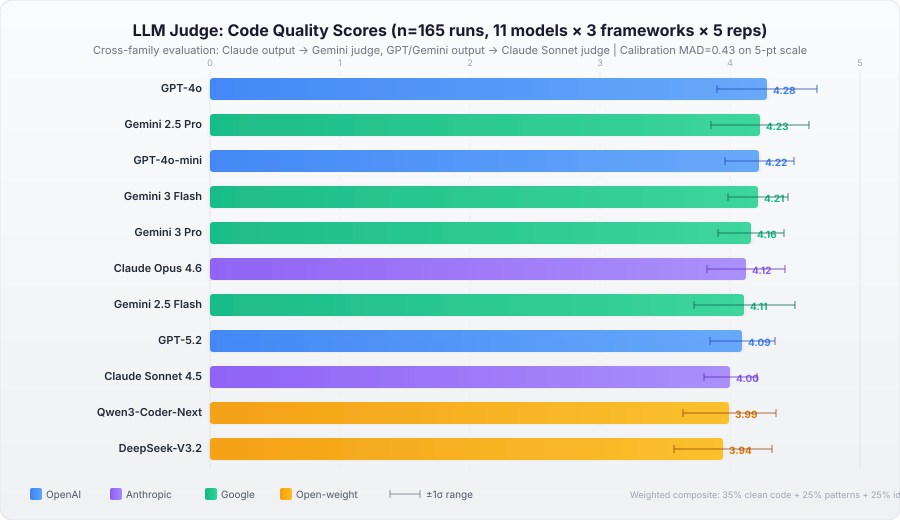

*Figure 5a: LLM-judged code quality scores (composite: 35% clean code + 25% patterns + 25% idioms + 15% organization). Error bars show ±1σ across 15 runs per model. The quality range (3.94–4.28) is far tighter than the functional correctness range, indicating all models produce structurally sound code regardless of gate pass rates.*

The quality leaderboard diverges significantly from the gate-based ranking:

| Rank | Model | Quality | Clean Code | Patterns | Idioms | Org | σ |
|:----:|-------|:-------:|:----------:|:--------:|:------:|:---:|:---:|
| 1 | GPT-4o | **4.28** | 4.52 | 84% | 82% | 4.17 | 0.38 |
| 2 | Gemini 2.5 Pro | **4.23** | 4.41 | 84% | 82% | 4.07 | 0.38 |
| 3 | GPT-4o-mini | **4.22** | 4.31 | 88% | 78% | 4.27 | 0.27 |
| 4 | Gemini 3 Flash | **4.21** | 4.41 | 85% | 78% | 4.17 | 0.23 |
| 5 | Gemini 3 Pro | **4.16** | 4.37 | 83% | 79% | 4.03 | 0.25 |
| 6 | Claude Opus 4.6 | **4.12** | 4.37 | 74% | 81% | 4.33 | 0.30 |
| 7 | Gemini 2.5 Flash | **4.11** | 4.31 | 79% | 82% | 3.93 | 0.39 |
| 8 | GPT-5.2 | **4.09** | 4.39 | 80% | 75% | 4.10 | 0.25 |
| 9 | Claude Sonnet 4.5 | **4.00** | 4.41 | 72% | 76% | 4.03 | 0.21 |
| 10 | Qwen3-Coder-Next | **3.99** | 4.36 | 68% | 82% | 3.97 | 0.36 |
| 11 | DeepSeek-V3.2 | **3.94** | 4.35 | 63% | 83% | 3.97 | 0.37 |

Three key insights emerge from the LLM-judged evaluation:

1. **Functional correctness ≠ code quality.** GPT-5.2 ranks #1 on Spring Boot gates (5.00 ± 0.00) but #8 on quality (4.09). Claude Sonnet 4.5, the overall gate leader (4.93), scores only 4.00 on quality — 9th of 11 models. The gate-based and quality-based rankings have only moderate correlation.

2. **Quality is compressed; correctness is not.** The top-to-bottom quality spread is just 0.34 points (4.28 to 3.94) on a 5-point scale, compared to a 1.60-point gate spread (4.93 to 3.33). All models produce *structurally sound* code; the differentiator is whether that code *works*.

3. **Design patterns separate the tiers.** Clean code scores are universally high (μ=4.38, σ=0.22), but pattern appropriateness ranges from 63% (DeepSeek) to 88% (GPT-4o-mini). Open-weight models match proprietary ones on clean code and idioms but trail significantly on design patterns — suggesting pattern awareness requires more sophisticated training data.

The full methodology, calibration report, and model×framework breakdown are in [Appendix G.7](#g7-llm-judged-quality-scoring).

All quality analysis data is in `pilot/results/quality_analysis/` and can be regenerated with `python pilot/quality_analysis.py`.

---

## 6. Prompt Templates

### 6.1 Brownfield Task Prompt (Python/FastAPI)

The following is the complete prompt template used for FastAPI tasks. ASP.NET Core and Spring Boot templates follow the same structure adapted to framework idioms.

````
You are an expert Python developer working on a FastAPI application.

## Task
Add /api/v1/orders endpoint with Pydantic validation and auth dependency

## Requirements
1. Create OrderItem model with product_id (str), quantity (int > 0), unit_price (float > 0)
2. Create OrderCreate model with items (list of OrderItem, non-empty) and notes (optional str)
3. Create OrderResponse model with id, items, total_amount, created_at, status
4. Add POST /api/v1/orders endpoint that requires authentication
5. Calculate total_amount as sum of (quantity * unit_price) for all items
6. Return 201 on success with created order
7. Return 401 if not authenticated
8. Return 422 if validation fails
9. Add tests for: (a) valid order creation, (b) unauthenticated access

## Constraints
- Do not add new dependencies
- Follow existing code conventions
- Use Pydantic v2 syntax
- Use async/await for all endpoints
- Use dependency injection via FastAPI Depends()

## Important Patterns

**Pydantic Field() validation:**
- Positive numbers: `Field(gt=0)`
- Non-empty lists: `Field(min_length=1)`
- Optional fields: `Optional[str] = None`

**Router pattern:**
```python
router = APIRouter()

@router.post("/orders", response_model=OrderResponse, status_code=status.HTTP_201_CREATED)
async def create_order(
    order: OrderCreate,
    current_user: User = Depends(get_current_user),
) -> OrderResponse:
    # Implementation
```

## Output Format

For each file you create or modify, provide:

FILE: path/to/file.py
---
<complete file contents>
---

CRITICAL: Provide COMPLETE file contents. No truncation. All imports present.

## EXISTING CODE (for context):

### Existing file: app/main.py
```python
...existing app code injected here...
```
````

**Template design rationale:**

- **Numbered requirements** map directly to test assertions, making pass/fail attributable to specific requirements.
- **Pattern examples** reduce ambiguity about framework idioms (e.g., which Pydantic v2 syntax to use).
- **Output format specification** is critical. Without explicit `FILE: path` block instructions, models produce inconsistent output structures that break automated extraction.
- **Baseline file injection** gives the model the real code it needs to integrate with—not a description of it.

### 6.2 Meta-Prompt Template (Model Preference Discovery)

```
You are about to help generate code for enterprise applications
across multiple frameworks:
- Python with FastAPI (REST APIs)
- C# with ASP.NET Core (Web APIs)
- Java with Spring Boot (REST Controllers)

Before we begin actual code generation tasks, I want to understand
YOUR preferences for optimal output quality.

Please analyze how you work best and provide guidance on:

## 1. Output Format
What format do you prefer for delivering code changes?
- XML tags (e.g., <code>, <file>, <thinking>)
- Markdown code blocks with file paths
- Unified diff format
- Other format you prefer

## 2. Instruction Style
What instruction style helps you generate the highest quality code?
- Detailed step-by-step instructions
- High-level goals with freedom to implement
- Constraint-based (must/must not requirements)
- Example-driven (showing desired patterns)

## 3. Context Presentation
How should we present existing code context to you?
- Full file contents inline
- File tree structure with key excerpts
- Minimal context (just the task)

## 4. Diff Generation
What's your preferred way to show code modifications?
- Unified diff format (git-style)
- Full file replacement
- Structured change description

## 5. Special Syntax or Markers
Are there special tags or syntax that help you structure output?

## 6. Quality Optimization
What guidance helps you produce more secure, tested, maintainable code?

## 7. Framework-Specific Preferences
Do you have different preferences for Python/FastAPI vs C#/ASP.NET
vs Java/Spring?

Be honest about what actually helps you generate better code.
```

### 6.3 Model-Specific Prompt Adaptations

Based on observed failure patterns, we added framework-specific guidance for GPT models on FastAPI:

```
**CRITICAL for GPT models:**
1. You MUST provide the complete modified version of app/main.py
   that includes BOTH the existing users router AND the new orders router.
2. All Pydantic Field() validations MUST use correct named parameters:
   - For numbers > 0: `Field(gt=0)` NOT `Field(0)`
   - For non-empty lists: `Field(min_length=1)` NOT `Field(min_items=1)`
3. All methods/functions MUST have complete type annotations
   including return types.
4. Use `from typing import List, Optional` for type hints.
5. Ensure mypy strict mode passes.
```

This guidance reduced—but did not eliminate—type-checking failures in GPT models.

### 6.4 Task Definition Schema

Task definitions use a simple YAML schema that can be extended for new tasks:

```yaml
id: <unique-task-id>            # e.g., "fastapi-001"
stack: <framework>              # fastapi | aspnetcore_9 | springboot_3_jdk17
type: brownfield_patch          # Task type
description: <one-line summary>

requirements:                   # Numbered requirements (map to test assertions)
  - "requirement 1"
  - "requirement 2"

constraints:
  output_format: unified_diff   # Expected output format
  max_new_deps: 0               # No new dependencies allowed
  must_update_tests: true       # Tests must be included

baseline_files:                 # Existing files provided as context
  - path/to/file.py

expected_changes:               # Files the model should create or modify
  - path/to/new_file.py

scoring_weights:                # Attribute weights (must sum to 1.0)
  security: 0.25
  stability: 0.20
  efficiency: 0.15
  parallelism: 0.10
  complexity: 0.10
  integration: 0.10
  stateful: 0.05
  entropy: 0.05
```

---

## 7. Implementation Guide

### 7.1 Supporting Data & Scripts

Raw data, prompt templates, task definitions, and the entropy control script are published in our research repository:

**https://github.com/engramforge/research/tree/main/llm-codegen-benchmark**

To reproduce the full benchmark, you'll need the complete llm-codebench repository.

### 7.2 Prerequisites

```bash
# Clone the repository
git clone https://github.com/engramforge/llm-codebench.git
cd llm-codebench

# Set up Python environment
cd pilot
python3 -m venv .venv
source .venv/bin/activate
pip install -e ".[dev]"

# Configure API keys
cat > ../.env.local << 'EOF'
OPENAI_API_KEY=sk-...
ANTHROPIC_API_KEY=sk-ant-...
EOF
```

### 7.3 Running a Single Benchmark

```bash
source .env.local
source pilot/.venv/bin/activate

# Single run (quick but unreliable for non-deterministic models)
python pilot/run_benchmark.py \
  --model gpt-4o-mini \
  --task fastapi-001

# With entropy control (recommended)
python pilot/run_benchmark.py \
  --model gpt-4o-mini \
  --task fastapi-001 \
  --entropy-control \
  --min-confidence 0.85 \
  --max-entropy-runs 5
```

### 7.4 Running the Full Benchmark Suite

```bash
#!/bin/bash
source .env.local
source pilot/.venv/bin/activate

MODELS=("claude-sonnet-4.5" "gemini:gemini-3-flash-preview" "gemini:gemini-3-pro-preview"
        "claude-opus-4.6" "gpt-4o" "gemini:gemini-2.5-pro" "gpt-5.2"
        "cloud:qwen3-coder-next" "cloud:deepseek-v3.2" "gpt-4o-mini"
        "gemini:gemini-2.5-flash")
TASKS=("fastapi-001" "aspnetcore-001" "springboot-001")

for model in "${MODELS[@]}"; do
  for task in "${TASKS[@]}"; do
    echo "Running: $model on $task"
    python pilot/run_benchmark.py \
      --model "$model" \
      --task "$task" \
      --entropy-control \
      --min-confidence 0.85 \
      --max-entropy-runs 5
  done
done
```

### 7.5 Analyzing Results

```bash
# Generate aggregated statistics from all runs
python pilot/analyze_results.py

# Output: ranked leaderboard, per-gate pass rates,
# Kruskal-Wallis, Mann-Whitney U, and Friedman tests
```

### 7.6 Discovering Model Preferences

```bash
# Profile a model's stated preferences
python pilot/discover_model_preferences.py --model gpt-4o-mini

# Run with preference-adapted prompts
python pilot/run_benchmark.py \
  --model gpt-4o-mini \
  --task fastapi-001 \
  --use-model-preferences
```

### 7.7 Adding a New Task

1. Create a task YAML in `suites/<framework>/tasks/<id>.yaml`
2. Ensure the baseline codebase exists with working tests
3. Create a prompt template in `pilot/prompt_<framework>.txt` (or reuse existing)
4. Run: `python pilot/run_benchmark.py --model <model> --task <new-id> --entropy-control`

### 7.8 Adding a New Model

```python
# For OpenAI-compatible models, add to OPENAI_MODELS dict:
OPENAI_MODELS = {
    "your-model": "your-model-id",
}

# For Anthropic models, add to ANTHROPIC_MODELS dict:
ANTHROPIC_MODELS = {
    "your-model": "your-model-api-id",
}

# For local Ollama models, use prefix:
# --model ollama:your-model-name
```

---

## 8. Limitations & Future Work

We want to be upfront about the scope of this study. It was designed to answer specific questions for our platform, not to serve as a comprehensive evaluation of LLM capabilities.

### 8.1 Current Limitations

**Small task set.** This pilot uses a single task (Add Orders endpoint) across three frameworks. While this controls for complexity, it may not generalize to other task types (refactoring, debugging, greenfield architecture).

**Meta-prompting tested on single framework only.** All 11 models have been profiled and A/B tested, but only on FastAPI (n=5 per condition, 110 total runs). The intervention is model-dependent (+3.0 gates for GPT-4o-mini, −1.4 for GPT-5.2). Whether these effects generalize across frameworks remains untested — a model that benefits from adapted prompts on Python may not on C# or Java.

**Sample sizes.** All 33 model×task cells have exactly n=5 runs (165 total across 11 models). While this is sufficient to detect large effects (Kruskal-Wallis p<0.001) and confirm the overall ranking, Mann-Whitney U tests found no significant differences between adjacent-ranked models. Detecting finer-grained distinctions in the top tier would benefit from n≥20 per cell.

**No adjacent-model differentiation.** Despite 165 runs, no adjacent pair in the ranking differs significantly at α=0.05. Models within ~0.5 gates of each other are statistically interchangeable. This is a fundamental limitation of the gate-based scoring resolution.

**Binary gate scoring.** Our 0–5 gate score treats all gates equally and doesn't capture partial quality differences. Two models that both pass all gates may differ substantially in code style, maintainability, or edge-case handling. The code quality meta-analysis and LLM-judged evaluation (Section 5.6, Appendix G.7) address this gap — and reveal that functional correctness rankings diverge substantially from qualitative code quality rankings.

**Excluded models.** Five models from the smoke-test era (Claude Sonnet 4, Claude Opus 4.5, Claude Haiku 4.5, Qwen2.5-Coder:7b/14b) only ran FastAPI and were excluded from the main analysis. Their raw data is preserved but lacks cross-framework coverage.

**Temperature fixed at 0.2.** All results use temperature 0.2 across all providers. A systematic temperature sensitivity study across the range [0.0, 1.0] would help understand how much variance is controllable.

### 8.2 Planned Next Steps

**Expanded task coverage.** We plan to add additional brownfield task types—bug fixes, refactoring, dependency upgrades, and security patches—to see if the patterns we observed here hold across different kinds of work.

**LLM-judged quality scoring.** ✅ **Complete.** All 165 entropy-controlled runs have been evaluated by cross-family LLM judges (Claude Sonnet 4.5 and Gemini 3 Pro Preview) against four qualitative dimensions: clean code principles, design pattern recognition, framework idiom adherence, and code organization. Results are reported in §5.6 and Appendix G.7. Key finding: the quality leaderboard diverges significantly from the gate-based ranking — GPT-4o leads on quality (4.28/5) while Claude Sonnet 4.5, the gate leader, scores 4.00/5 (9th of 11). Calibration inter-rater MAD = 0.43 on 5-point scale. Total judge pipeline cost: $4.21.

**Meta-prompting expansion.** ✅ **Complete.** All 11 models have been profiled and A/B tested with n=5 per condition on FastAPI (110 total runs). Results are reported in §4.3, §4.4, and §5.4. The intervention shows a model-dependent positive trend (+6.1% mean improvement) with 3/11 individually significant effects (2 positive, 1 negative). The remaining open question is whether the effect differs across frameworks — the current data covers only FastAPI.

**Weighted quality scoring under entropy.** Our eight-attribute weighted scoring system (Section 2, Appendix B) has been applied to 64 runs via `pilot/score_all_results.py`. Extending it to all 165 entropy-controlled runs and reporting weighted quality with confidence intervals per model is the next step.

**Temperature sensitivity testing.** Varying temperature systematically (e.g., [0.0, 0.2, 0.5, 0.8, 1.0]) would help us understand how much of the observed variance is controllable via API parameters versus inherent to the model.

**Iterative refinement measurement.** Our tooling supports multi-iteration refinement where failures from one run are fed back as context for the next. We plan to measure self-correction rates across models.

**Increased sample sizes for top-tier differentiation.** Claude Sonnet 4.5, Gemini 3 Flash, and GPT-4o all score 4.93 in a three-way tie for #2 behind Gemini 3 Pro (5.00). With only n=5, distinguishing between them requires n≥20 per cell.

---

## 9. Conclusions

### What We Learned

This pilot study was a practical exercise in applying scientific method to a systems engineering problem. We had assumptions about model quality based on ad hoc testing; the data told a different story. What started as a 5-model, 79-run comparison grew to 11 models across 165 entropy-controlled runs (33 cells × n=5), with formal statistical testing that reshaped our original conclusions. Here's what we took away:

### Decisions This Informed

1. **We changed our model selection — twice.** Initial testing suggested GPT-4o was the clear leader. Entropy-controlled re-runs showed it tied with Claude Sonnet 4.5 and Gemini 3 Flash at 4.93/5. Then Gemini 3 Pro Preview emerged as the only model with a perfect 5.00 mean. Each round of more rigorous testing changed our recommendation.

2. **We built variance into our architecture.** Knowing that some model/task combinations have high variance (GPT-5.2 on FastAPI: σ=2.74), we designed our subsystem to handle retries and fallbacks rather than assuming a single call will succeed.

3. **We automated multi-run testing.** The entropy control system is now part of our standard evaluation process for any new model or prompt change. It takes a few minutes more and prevents us from making decisions based on lucky runs.

4. **We index on per-gate failures, not just pass/fail.** Claude Opus 4.6 consistently passed 4/5 gates on FastAPI — the failure was always lint, never tests or types. That's a very different issue than GPT-4o-mini's 67% test pass rate, and it calls for a different mitigation strategy.

5. **We match model cost to task requirements.** Gemini 3 Flash Preview at $0.005/run achieves 4.93/5 gates — the same quality as Claude Sonnet 4.5 at $0.043/run. For non-critical Python tasks, the 8.6× cost savings is material.

6. **Statistical testing prevents over-reading the data.** Mann-Whitney U tests showed no significant differences between any adjacent-ranked models. Without these tests, we would have drawn false conclusions from the ranking order alone.

7. **Meta-prompting helps mid-tier models but can hurt top performers.** Profiling all 11 models and running 110 A/B test runs revealed that preference-adapted prompts dramatically improved GPT-4o-mini (+3.0 gates) and Claude Opus 4.6 (+1.2 gates) but degraded GPT-5.2 (−1.4 gates). The lesson: prompt format optimization is model-specific and should be validated per-model, not applied universally.

8. **Correctness and quality are different axes, and the best model depends on which you optimize.** LLM-judged quality evaluation (Section 5.6) revealed that the gate-based ranking and qualitative ranking diverge substantially. Claude Sonnet 4.5 leads on correctness (4.93/5 gates) but ranks 9th of 11 on quality (4.00/5). GPT-4o leads on quality (4.28/5) but ranks 4th on gates. When we compute a combined score (60% correctness + 40% quality), GPT-4o emerges as the overall best, with Gemini 3 Pro second. This changed our model selection again — and convinced us that our evaluation pipeline needs both dimensions permanently.

### Advice for Others Building Similar Systems

1. **Test with your actual codebase.** Model performance varies significantly by framework, codebase conventions, and task type. Published benchmarks may not predict performance on your specific integration.

2. **Run multiple times before trusting results.** A single successful run from a non-deterministic system doesn’t tell you much. Even 3 runs with mean and standard deviation gives a much clearer picture.

3. **Watch for survivorship bias in your own process.** When you’re iterating on prompts and testing models during development, you naturally end up reporting the best result. Build systematic multi-run testing into your workflow early to avoid this.

4. **Measure quality, not just correctness.** Code that passes tests can still be poorly structured. Our LLM-judged evaluation found the gate-based ranking and qualitative ranking share only moderate correlation — the model that produces the most “correct” code is not the one that produces the “best” code. If your downstream consumers are human developers, quality matters.

5. **Treat the evaluation pipeline as infrastructure, not a one-time study.** The testbench we built to answer “which model?” became a regression suite for model updates, prompt changes, and new task types. Investing in evaluation tooling pays compound returns.

---

## 10. Appendices

### Appendix A: Complete FastAPI Prompt

See Section 6.1 for the full template. The actual prompt sent to the model also includes the contents of:
- `app/main.py` (existing FastAPI application)
- `app/routers/__init__.py` (router registration)
- `app/dependencies/auth.py` (authentication dependency)
- `tests/conftest.py` (test fixtures)

Total prompt length: ~5,700 characters before model-specific additions.

### Appendix B: Scoring Weights

```yaml
scoring_weights:
  security: 0.25      # Input validation, auth, injection prevention
  stability: 0.20     # Test pass rate, error handling
  efficiency: 0.15    # Algorithmic choices, resource usage
  parallelism: 0.10   # Async patterns, thread safety
  complexity: 0.10    # Cyclomatic complexity, maintainability
  integration: 0.10   # Diff quality, minimal changes
  stateful: 0.05      # State management, idempotency
  entropy: 0.05       # Consistency across runs
```

### Appendix C: GPT-4o-mini FastAPI Failure Analysis

The most common failure in GPT-4o-mini's FastAPI output (6 of 9 runs) was a `NameError` in `app/routers/orders.py`:

```python
# Generated code (broken):
from app.dependencies.auth import get_current_user
from app.models.order import OrderCreate, OrderResponse

@router.post("/orders", ...)
async def create_order(
    order: OrderCreate,
    current_user: User = Depends(get_current_user),  # ← User not imported
) -> OrderResponse:
```

The model used the `User` type annotation in the function signature but did not import it from `app.models.user`. This is a precisely identifiable, recurring failure pattern that persisted across runs despite the prompt including the existing auth module's source code.

### Appendix D: GPT-5.2 FastAPI Failure Analysis

GPT-5.2 exhibited a bimodal distribution on FastAPI: individual runs scored either 5/5 or 0/5, with no intermediate results:

```
Run scores: [5, 0, 5, 0, 5]
```

The 0/5 runs failed at diff extraction—the model produced output in a format that the parser could not extract file blocks from. When extraction succeeded, all subsequent gates passed. This suggests the model's output format compliance is inconsistent rather than its code quality.

### Appendix E: Tool Versions

| Tool | Version | Purpose |
|------|---------|---------|
| Python | 3.12 | Runtime |
| FastAPI | 0.115.x | Python framework |
| pytest | 8.x | Python testing |
| mypy | 1.x | Python type checking |
| ruff | 0.8.x | Python linting |
| .NET SDK | 9.0 | C# runtime |
| xUnit | 2.x | C# testing |
| Java JDK | 17 | Java runtime |
| Spring Boot | 3.x | Java framework |
| Maven | 3.9.x | Java build |
| Ollama | 0.5.x | Local model hosting |

### Appendix F: Repository Structure

```
llm-codebench/
├── suites/
│   ├── bench-fastapi/          # Python/FastAPI baseline + task
│   ├── bench-aspnetcore/       # C#/ASP.NET Core baseline + task
│   └── bench-springboot/       # Java/Spring Boot baseline + task
├── pilot/
│   ├── run_benchmark.py        # Main benchmark runner
│   ├── entropy_control.py      # Variance detection & re-run management
│   ├── weighted_scoring.py     # 8-attribute quality scoring
│   ├── adaptive_prompting.py   # Prompt adaptation based on preferences
│   ├── discover_model_preferences.py  # Meta-prompting experiment
│   ├── compare_preference_impact.py   # A/B testing infrastructure
│   ├── quality_analysis.py            # Code quality meta-analysis (Layer 1-4)
│   ├── score_all_results.py           # Weighted 8-attribute scoring
│   ├── analyze_results.py             # Results aggregation + stats tests
│   ├── prompt.txt              # FastAPI prompt template
│   ├── prompt_aspnetcore.txt   # ASP.NET Core prompt template
│   ├── prompt_springboot.txt   # Spring Boot prompt template
│   ├── model_preferences/      # Stored preference profiles
│   └── results/                # All benchmark run outputs
└── rebenchmark_with_entropy.sh # Full suite re-run script
```

### Appendix G: Code Quality Meta-Analysis

This appendix details the code quality meta-analysis methodology and results. All data was generated from 165 entropy-controlled runs (n=5 per cell) across 11 models × 3 languages.

#### G.1 Analysis Layers

The meta-analysis operates as a four-layer pipeline. Raw generated code enters at Layer 1 (per-run structural extraction), feeds into Layer 2 (intra-model consistency), which enables Layer 3 (inter-model comparison), and culminates in Layer 4 (generation fingerprinting). Each layer builds on the one below it.

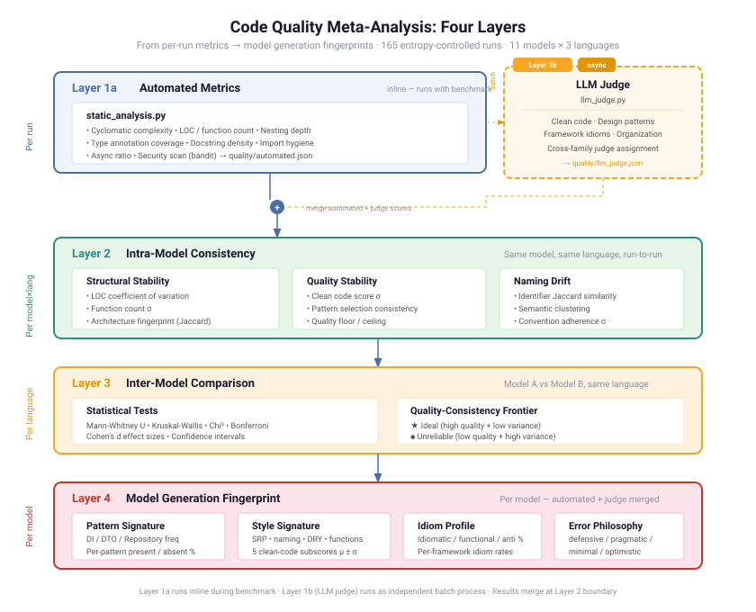

*Figure 6: Four-layer analysis architecture. Layer 1a extracts per-run structural metrics inline during the benchmark pipeline. Layer 1b (LLM judge) runs as an independent batch process against stored artifacts. Results merge at the Layer 2 boundary, where intra-model consistency analysis operates on the combined metric set. Layer 3 compares models head-to-head. Layer 4 aggregates characteristic patterns into model generation fingerprints.*

The end-to-end data flow from benchmark runner through analysis to visualization is shown below:

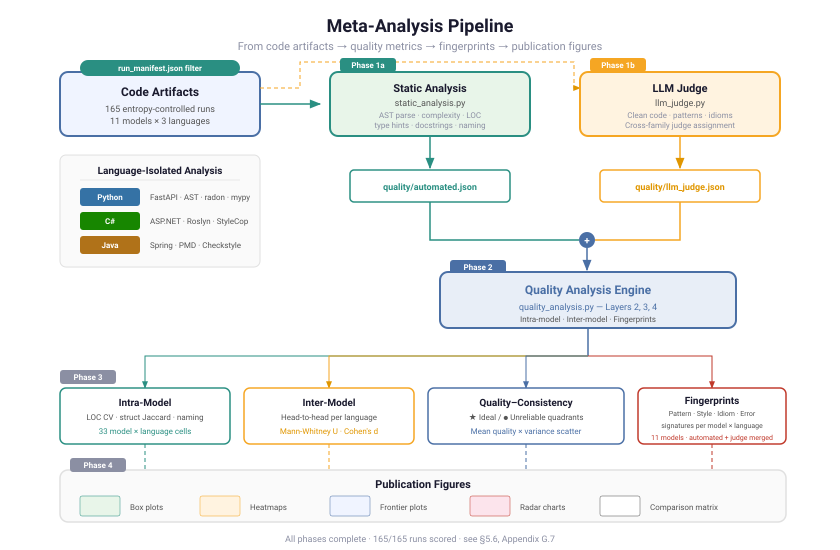

*Figure 7: Data pipeline from 165 entropy-controlled runs through quality extraction, aggregation, and visualization. Each run's generated code artifact is fed through language-specific static analysis tools, then aggregated at model×language granularity.*

#### G.2 Per-Run Quality Rubric (Layer 1)

Every generated code artifact is measured against automated structural metrics:

| Metric | Tool/Method | What It Captures |
|--------|-------------|------------------|
| Lines of code (LOC) | `cloc` / line count | Output volume and verbosity |
| Function/method count | AST parse | Decomposition granularity |
| Max nesting depth | AST parse | Structural complexity |
| Cyclomatic complexity | `radon` (Python) | Path complexity |
| Type annotation coverage | `mypy --stats` (Python) | Type safety commitment |
| Docstring density | AST parse | Documentation habits |
| Security findings | `bandit` (Python) | SAST issue count |
| Naming convention compliance | Pattern match | PEP 8 / .NET / Java conventions |

#### G.3 Intra-Model Consistency (Layer 2)

For each model × language cell, we compute pairwise similarity across runs:

| Metric | Calculation | Interpretation |
|--------|-------------|----------------|
| **LOC coefficient of variation** | CV = σ/μ of total LOC | >0.3 = high structural instability |
| **Function count stability** | σ of function count | Does the model decompose consistently? |
| **Structure Jaccard similarity** | Jaccard index of file/class/function name sets | 1.0 = identical structure every run |
| **Naming Jaccard similarity** | Jaccard index of all identifier names | 1.0 = identical naming every run |

#### G.4 Quality-Consistency Frontier (Results)

The frontier ranks all 33 model × language cells by both quality (gates passed) and structural consistency. Selected entries:

| Model | Language | Gates (mean) | Perfect Rate | LOC (mean) | LOC CV | Structure J | Naming J |
|-------|----------|-------------|-------------|-----------|--------|------------|----------|
| Claude Opus 4.6 | C# | 5.00 | 100% | 307 | 0.001 | 1.00 | 1.00 |
| Claude Sonnet 4.5 | Java | 5.00 | 100% | 320 | 0.011 | 1.00 | 1.00 |
| Gemini 3 Flash | C# | 5.00 | 100% | 248 | — | 0.84 | 1.00 |
| Gemini 3 Pro | Python | 5.00 | 100% | — | — | 1.00 | 1.00 |
| GPT-4o | Java | 5.00 | 100% | — | — | 0.78 | 0.93 |
| Claude Sonnet 4.5 | Python | 4.80 | 80% | — | — | 1.00 | 1.00 |
| GPT-5.2 | Python | 3.00 | 60% | — | — | 0.84 | 0.90 |
| DeepSeek V3.2 | C# | 3.00 | 60% | 245 | 0.395 | 0.67 | 0.85 |
| GPT-4o-mini | Python | 0.80 | 0% | — | — | 0.88 | 0.93 |

The frontier reveals that **gate pass rate and structural consistency are correlated but not identical.** GPT-4o achieves 5.00 gates on Java but has the lowest structure Jaccard (0.78) of any perfect scorer — its code works every time but is organized differently each time. Claude models achieve both perfect gates and perfect structural consistency.

The scatter plot below visualizes all 33 cells on the quality (x-axis) vs. consistency (y-axis, inverted so top = better) plane. The ideal quadrant — high quality, low variance — is at the top right. The tight cluster of 14 perfect-scoring cells contrasts sharply with the scattered outliers in the bottom-left "unreliable" quadrant.

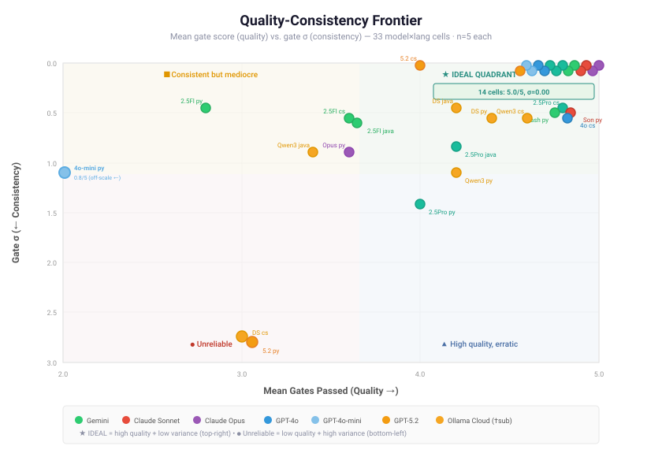

*Figure 8: Quality-consistency frontier across 33 model×language cells (n=5 each). X-axis: mean gates passed (quality). Y-axis: gate σ, inverted so lower variance = higher on chart. Top-right quadrant is ideal. GPT-4o-mini on Python (0.8/5) is off-scale left. The 14-cell perfect cluster at (5.0, σ=0.0) demonstrates that perfect reliability is achievable — but only by roughly half the model×language combinations.*

#### G.5 Model Generation Fingerprints (Layer 4)

Layer 4 merges automated metrics with LLM judge assessments to produce four sub-signatures per model. The table below shows cross-language aggregates; per-language breakdowns are in `model_fingerprints.json`.

| Model | Quality | Idiom | Error Philosophy | Error Score | Top Patterns (≥50% presence) |
|-------|---------|-------|------------------|-------------|-----------------------------|
| **Claude Opus 4.6** | 4.12 | 83% | pragmatic | 3.5 | DI: 100%, DTO: 67% |
| **Claude Sonnet 4.5** | 4.00 | 78% | pragmatic | 3.5 | DI: 100%, DTO: 67% |
| **DeepSeek V3.2** | 3.94 | 85% | pragmatic | 3.5 | DI: 100%, DTO: 53% |
| **Qwen3 Coder** | 3.99 | 83% | minimal | 3.5 | DI: 100%, DTO: 60% |
| **Gemini 2.5 Flash** | 4.11 | 82% | minimal | 3.3 | DI: 100%, DTO: 100% |
| **Gemini 2.5 Pro** | 4.23 | 82% | pragmatic | 3.6 | DI: 100%, DTO: 100%, Layered: 60% |
| **Gemini 3 Flash** | 4.21 | 78% | minimal | 3.3 | DI: 100%, DTO: 100%, Layered: 60% |
| **Gemini 3 Pro** | 4.16 | 79% | minimal | 3.4 | DI: 100%, DTO: 100%, Layered: 67% |
| **GPT-4o** | 4.28 | 82% | pragmatic | 3.6 | DI: 100%, DTO: 100%, Layered: 53% |
| **GPT-4o-mini** | 4.22 | 78% | minimal | 3.3 | DI: 100%, DTO: 100%, Layered: 67% |
| **GPT-5.2** | 4.09 | 75% | minimal | 3.3 | DI: 100%, DTO: 100%, Layered: 53% |

*Quality = LLM-judged composite (0–5). Idiom = overall idiomatic adherence rate. Error Score = clean_code.error_handling mean (1–5). Pattern percentages = fraction of runs where pattern was PRESENT_CORRECT.*

Notable fingerprint differences:

- **Pattern split**: Gemini and GPT families consistently apply all three enterprise patterns (DI + DTO + Layered Architecture); Claude and DeepSeek skip Layered Architecture and have lower DTO adoption
- **Error handling** is universally the weakest clean-code dimension (3.3–3.6/5), with "minimal" philosophy dominating — only Claude and DeepSeek reach "pragmatic"
- **Idiom adherence** is highest for DeepSeek V3.2 (85%) despite its structural instability — it knows the conventions even when its output shape varies
- **Quality vs correctness divergence**: GPT-4o ranks #1 on judge quality (4.28) but mid-pack on gates; GPT-4o-mini ranks #2 on quality (4.22) despite 0.8/5 Python gates — the models write clean code that doesn't always compile

The radar chart below overlays fingerprint profiles for five representative models. Each axis represents a normalized dimension (0.0 = worst, 1.0 = best) drawn from `model_fingerprints.json`. The area enclosed by each polygon corresponds to overall generation quality — larger and more regular polygons indicate stronger, more balanced models.

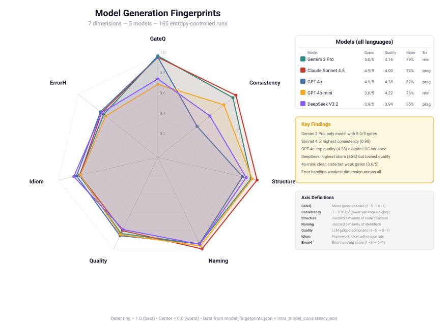

*Figure 9: Generation fingerprint radar for five representative models across seven dimensions: GateQ (gate pass rate), Consistency (LOC CV inverted), Structure (Jaccard similarity), Naming (identifier Jaccard), Quality (LLM-judged composite), Idiom (framework idiom adherence rate), and ErrorH (error handling score). Data generated from model_fingerprints.json. Claude Sonnet 4.5 fills nearly the entire chart with near-perfect consistency; GPT-4o's polygon dips sharply on Consistency due to high LOC variance on Java/C# (CV=0.28/0.33). DeepSeek V3.2 scores highest on Idiom (0.85) but lowest on Quality (0.79).*

#### G.6 Stylistic Entropy Heatmap

Beyond aggregate fingerprints, we can examine where *within* each model's output the variance concentrates. The stylistic entropy heatmap shows, for each model × quality dimension, how much run-to-run variation exists. High entropy (warm colors) indicates that the model's behavior on that dimension is unpredictable; low entropy (cool colors) indicates deterministic output.

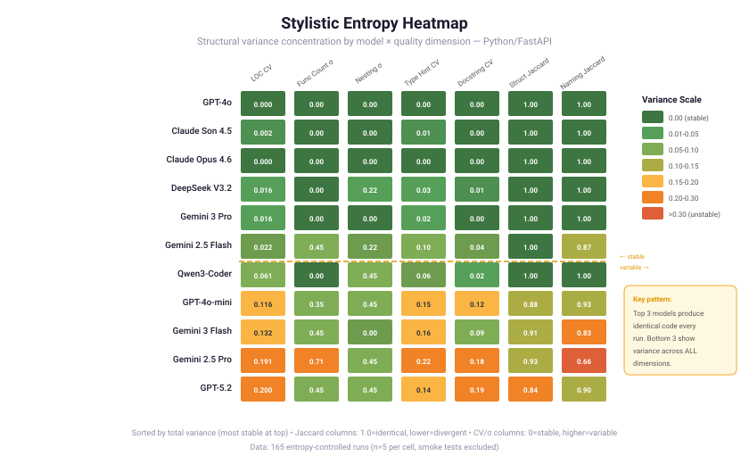

*Figure 10: Stylistic entropy heatmap across 11 models and quality dimensions. Warm colors indicate high run-to-run variance on that dimension; cool colors indicate deterministic output. The heatmap reveals that type annotation coverage and docstring density are the highest-entropy dimensions across most models — models are most inconsistent in their documentation and typing habits, not in their structural choices.*

Full data: `pilot/results/quality_analysis/model_fingerprints.json`, `intra_model_consistency.json`, `inter_model_comparison.json`, `quality_consistency_frontier.json`.

#### G.7 LLM-Judged Quality Scoring

Layers 1a through 4 form an integrated pipeline. Layer 1a (automated metrics) characterizes code *structure*; Layer 1b (LLM judge) provides *qualitative* evaluation. Both feed into Layers 2–4. Each of the 165 entropy-controlled runs is scored by a cross-family LLM judge against a rubric covering four dimensions.

**Rubric dimensions:**

| Dimension | Scale | What It Measures |
|-----------|-------|------------------|
| Clean Code Index | 1–5 | Single responsibility, meaningful names, small functions, DRY, error handling (per Robert C. Martin) |
| Pattern Appropriateness | 0–100% | Correct application of DI, Repository, DTO, and layered architecture patterns |
| Idiom Adherence | 0–100% | Framework-specific idiomatic usage (async/await, Depends(), @Valid, etc.) |
| Organization | 1–5 | File structure, configuration separation, project layout |

The composite score weights these as: 35% clean code + 25% patterns + 25% idioms + 15% organization.

**Judge assignment.** To prevent self-evaluation bias, judge assignment is cross-family:

| Code Author | Judge Model | Rationale |
|-------------|-------------|-----------|
| Claude (Opus 4.6, Sonnet 4.5) | Gemini 3 Pro Preview | Different family; lowest-cost judge |
| GPT (4o, 4o-mini, 5.2) | Claude Sonnet 4.5 | Different family; highest structure Jaccard |
| Gemini (2.5 Flash/Pro, 3 Flash/Pro) | Claude Sonnet 4.5 | Different family |
| Open-weight (DeepSeek, Qwen) | Gemini 3 Pro Preview | Cost-efficient |

Distribution: Claude Sonnet 4.5 judged 105 runs; Gemini 3 Pro Preview judged 60 runs. All calls used temperature=0.0 for deterministic scoring.

**Calibration.** Five runs were scored by *both* judges to measure inter-rater reliability:

| Dimension | MAD | Pearson r | Interpretation |
|-----------|:---:|:---------:|----------------|
| Clean Code Index | 0.12 | n/a | Tight agreement — most concrete rubric |
| Pattern Appropriateness | 0.20 | 0.52 | Moderate — subjective pattern classification |
| Idiom Adherence | 0.17 | 0.43 | Moderate — framework-specific knowledge varies |
| Organization | 0.50 | 0.58 | Widest gap — Gemini stricter on file structure |
| **Overall Quality** | **0.43** | **0.49** | **Acceptable for 5-point scale** |

Systematic bias: Gemini scores 0.43 lower than Claude on average. Since Claude judges GPT/Gemini output and Gemini judges Claude/open-weight output, Claude-family and open-weight models face a stricter grader — their true quality may be ~0.2 points higher than reported.

**Results: Model × Framework Grid**

| Model | FastAPI | ASP.NET Core | Spring Boot | Overall |
|-------|:-------:|:------------:|:-----------:|:-------:|
| GPT-4o | 4.12 | **4.62** | 4.10 | **4.28** |
| Gemini 2.5 Pro | 4.00 | **4.64** | 4.05 | **4.23** |
| GPT-4o-mini | 4.03 | **4.44** | 4.21 | **4.22** |
| Gemini 3 Flash | 4.20 | **4.38** | 4.06 | **4.21** |
| Gemini 3 Pro | 4.07 | **4.44** | 3.96 | **4.16** |
| Claude Opus 4.6 | 3.87 | **4.54** | 3.95 | **4.12** |
| Gemini 2.5 Flash | 3.94 | **4.57** | 3.80 | **4.11** |
| GPT-5.2 | 4.07 | **4.32** | 3.88 | **4.09** |
| Claude Sonnet 4.5 | 3.85 | **4.20** | 3.95 | **4.00** |
| Qwen3-Coder-Next | 3.85 | **4.44** | 3.69 | **3.99** |
| DeepSeek-V3.2 | 3.88 | **4.32** | 3.63 | **3.94** |

ASP.NET Core elicits the best quality across all models (mean 4.45 vs FastAPI 3.99 and Spring Boot 3.94). The strongly-typed, convention-based C# framework guides models toward correct patterns. Spring Boot's annotation complexity and FastAPI's flexibility leave more room for anti-patterns.

**Key findings:**

1. **Quality range is compressed (3.94–4.28).** The top-to-bottom spread is only 0.34 points on a 5-point scale — far tighter than the gate-based spread (4.93–3.33). All 11 models produce structurally sound code even when tests fail.

2. **Clean code is universally high (μ=4.38, σ=0.22).** Every model scores above 4.0 on naming, SRP, small functions, DRY, and error handling. Models have converged on clean code patterns from training data.

3. **Design patterns separate the tiers.** Pattern appropriateness ranges from 63% (DeepSeek) to 88% (GPT-4o-mini). Top models correctly apply DI, Repository, DTO, and layered architecture; weaker models tend to flatten service layers or skip DTO separation.

4. **Functional correctness ≠ code quality.** GPT-5.2 ranks #1 on Spring Boot gates (5.00 ± 0.00) but #8 on quality (4.09). Claude Sonnet 4.5 passes all ASP.NET Core gates but scores only 4.00 overall. GPT-4o-mini has the lowest quality variance (σ=0.27) and highest pattern score (88%) despite middling gate performance on FastAPI.

5. **Open-weight models close the quality gap but not the pattern gap.** Qwen3-Coder-Next and DeepSeek-V3.2 match proprietary models on clean code (4.36, 4.35) and idioms (82%, 83%) but trail significantly on design patterns (68%, 63%).

6. **ASP.NET Core elicits the best quality across all models (+0.46 vs FastAPI).** The strongly-typed, convention-based C# framework guides models toward correct patterns regardless of provider.

**Cost:** Total judge pipeline: $4.21. Per-run: ~$0.026 (Claude Sonnet: $0.05/call × 105 runs, Gemini 3 Pro: $0.015/call × 60 runs). Calibration: ~$0.35 (5 runs × 2 judges).

Full data: `pilot/results/quality_analysis/judge_summary_full.json`, `calibration_report.json`. Per-run judge output: `pilot/results/<run>/quality/llm_judge.json`.

---

*This pilot study documents our process for making data-driven model selection and prompt engineering decisions. We share it in case the methodology is useful to other teams integrating LLMs into their systems. Raw data, prompt templates, task definitions, and reproduction scripts are available in the [research repository](https://github.com/engramforge/research/tree/main/llm-codegen-benchmark).*
